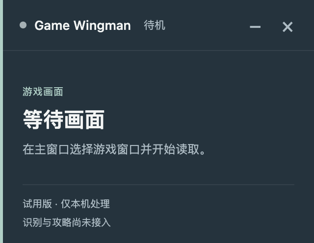

# Game Wingman


**An experimental desktop game companion. TFT first, more games later.**

[简体中文](README.zh-CN.md) · [Windows handoff](docs/windows-handoff.md) · [API providers](docs/api-providers.md) · [Report a bug](https://github.com/maxuod/game-wingman/issues/new/choose)

Game Wingman is a Windows/macOS desktop application built with Electron and TypeScript. The intended workflow is to read a selected game window, recognize visible information, retrieve versioned guides, and present a short explanation in a floating overlay. The first reference game is **Teamfight Tactics on NA, with en_US entity names**.

This public preview is for feedback and for developing reusable capture, recognition, retrieval and overlay components. It is an early prototype, not a finished AI coach.

> **Experimental software and account risk:** This project is not endorsed by Riot Games. Contextual real-time advice may conflict with game policies, and use may result in account penalties, including bans. No account-safety, accuracy or performance guarantees are made. A prototype label does not exempt a tool from game rules. Read the [trial notice](docs/usage.md) before use.

## Data sources and attribution

Sources are not limited to OP.GG. The [source registry](docs/data-sources.md) records owners, links, fields used, versions, update scope and usage conditions for Riot, OP.GG, CommunityDragon and other sources. It distinguishes public-code integrations, local development, research and candidates. New sources must update this registry and the [third-party notices](THIRD_PARTY_NOTICES.md).

## What works today

| Component | Status |
| --- | --- |
| Desktop control window and independent always-on-top overlay | Implemented; macOS and Windows smoke-tested |
| Selected-window preview, pause/resume, image import | Implemented; tested with synthetic windows on macOS and Windows |
| Collapsing, transparency, click-through and recovery controls | Implemented; game-specific compatibility unverified |
| NA Data Dragon name lookup | Manual sync, search and pinning for Set 18 champions/traits |
| MiniMax CN / DeepSeek / Gemini | Text and image adapters, desktop settings and OS-encrypted credentials; live synthetic probes passed |
| Manual screenshot recognition | Per-frame confirmation, structured fields, unknown values, correction and overlay display; real TFT quality unverified |
| Live video observation | Explicit session consent; sampled image requests every 5–15 seconds, latest fields and change history. This preview locks desktop AI to DeepSeek Flash with a persistent CNY 10 cap; [test instructions](docs/deepseek-first-test.md) |
| OP.GG comp references | All 50 current main-page variants, Chinese search, paging, full unit/item lists, team-code copying and overlay selection. Independent win/top-four sorting, top-four by default; public refresh on startup or request |
| Equipment | 137 items / 55 recipes; consented live equipment recognition automatically updates crafts for the selected or current recommended comp. Reference builds remain available without inventory, with source positions (39/50 boards) and on-demand per-comp augment candidates; [scope](docs/automatic-equipment.md). Real-game accuracy remains unverified |
| Data updates | Daily startup checks official TFT patches; valid same-day cache is reused. Rankings refresh after six hours or an official change, with independent rank movements. Recipes remain versioned until official evidence is reviewed; [update rules](docs/daily-data-updates.md) |
| Auto discovery / overlay | Unique TFT window auto-previews locally; with saved DeepSeek credentials and AI requests enabled, the app prompts for one session consent and then starts live observation. The main window shows the four highest eligible top-four comps for selection. The overlay stays topmost and nonfocusable; [scope and validation](docs/guide-preview.md) |
| Windows | Development app and portable package smoke-tested; real TFT testing pending |

The name dictionary is **not** a tactical guide database or an NA win-rate dataset. A Data Dragon asset version does not establish the TFT patch or hotfix coverage. See the [dated data-source review](docs/tft-data-sources-2026-09-24.md).

## Interface

The main screen has three primary actions: select a window, start/pause capture, and show/hide the overlay. Sources and settings live in a secondary panel. The overlay shows one item at a time.




These are application screenshots. They show the current capture/lookup shell, not completed AI recommendations. The old `design/overlay-concept.html` is an archived design study, not the product entry point.

## Run from source

Use Git and **Node.js 22.12–22.x**; `.nvmrc` pins the locally tested version. No API key is needed to run the desktop shell.

```sh
git clone https://github.com/maxuod/game-wingman.git "game wingman"
cd "game wingman"
npm ci
npm start
```

On Windows, run these commands in PowerShell or a terminal. On macOS, selected-window capture may require Screen Recording permission; development launches can appear as Electron. Restart the application after granting permission if necessary. Image import remains available without screen capture.

```sh
npm run check          # Type checks
npm test               # Build + offline tests; no paid API requests
npm run test:desktop   # Native smoke tests using only a generated fixture window
npm run package:win    # Windows x64 portable application folder
npm run package:mac    # macOS arm64 .app
```

Output is under `release/`. Keep the entire Windows application folder together. Builds are unsigned/unnotarized development artifacts. A successful build or synthetic test is not evidence of compatibility with TFT or anti-cheat software. The [Windows handoff](docs/windows-handoff.md) is the starting point for the next session.

## API providers

Open **资料与设置 → AI 识别 → API Key 配置** to select a provider and paste your own key into the masked field. Saving uses OS encryption and clears the field. You can also import a local `.env`/JSON file or export an empty template; [api-keys.example.json](api-keys.example.json) contains only empty fields. Import recognizes provider-specific field names and never enables AI or sends a request. See the [setup guide](docs/api-providers.md).

MiniMax, DeepSeek and Gemini share a text/image interface in `src/main/ai/providers.ts`. This first-test desktop preview fixes DeepSeek Flash and a persistent CNY 10 budget shared by live, manual and probe requests. Credentials remain OS-encrypted. Manual screenshots require individual confirmation; live sampling requires separate session consent. Local preview alone never uploads frames.

Copy `.env.example` to `.env` and fill only the provider you intend to test:

```powershell
Copy-Item .env.example .env
npm run api:check -- minimax
npm run api:check -- deepseek
npm run api:check -- gemini
```

These checks are local and do not validate a key against the provider. For an **optional live probe**, set `AI_ENABLED=true` in your local `.env`, then run:

```sh
npm run api:check -- minimax --probe
```

A CLI probe sends one fixed text prompt to the selected provider. Charges may apply. It sends no screenshot, game state or local file. There are no automatic retries or cross-provider fallbacks. Live text and synthetic-image measurements now cover DeepSeek Flash, MiniMax M3 CN and Gemini 3.5 Flash Lite; [configuration, measured latency and limits](docs/api-providers.md) are documented separately.

## Privacy and security

Comp cards, inventory, crafting suggestions, source positioning and augment candidates use game icons with hover/focus names and readable fallback labels. Validated public images load on demand into a seven-day local cache without AI calls. The latest Windows preview is `release/api-config-preview/Game Wingman-win32-x64/`; exit the older app before starting it. The cumulative CNY 10 ledger is preserved.

Desktop preview frames stay in application memory. Manual recognition sends one confirmed frame; separately consented live tracking sends sampled frames until stopped. The app does not save screenshots by default. Public entity data can be cached locally. API keys are OS-encrypted outside the source tree and never exposed through renderer IPC or bundled. See [PRIVACY.md](PRIVACY.md) and [SECURITY.md](SECURITY.md).

## Development and feedback

- [Windows handoff and next tasks](docs/windows-handoff.md)
- [Roadmap](docs/roadmap.md) / [Change log](CHANGELOG.md)
- [Desktop validation and limitations](docs/desktop-validation.md)
- [Technical design](docs/technical-plan.md) / [Product scope](docs/product-brief.md)
- [Contributing](CONTRIBUTING.md) / [Issues](https://github.com/maxuod/game-wingman/issues)

The current TFT version includes live equipment recognition, comp references, game icons and API Key configuration. Keys are configured in the desktop settings or imported from a local file; real-game accuracy remains unverified.

## License and third-party content

This is a **public source preview; no open-source reuse license has been selected yet** (`UNLICENSED`). Public availability is not a license grant. Dependency licenses remain their own; see [third-party notices](THIRD_PARTY_NOTICES.md). Riot names and assets belong to their respective owners. No ARAM-tool code, commercial guide corpus or third-party UI assets are copied into this project.
