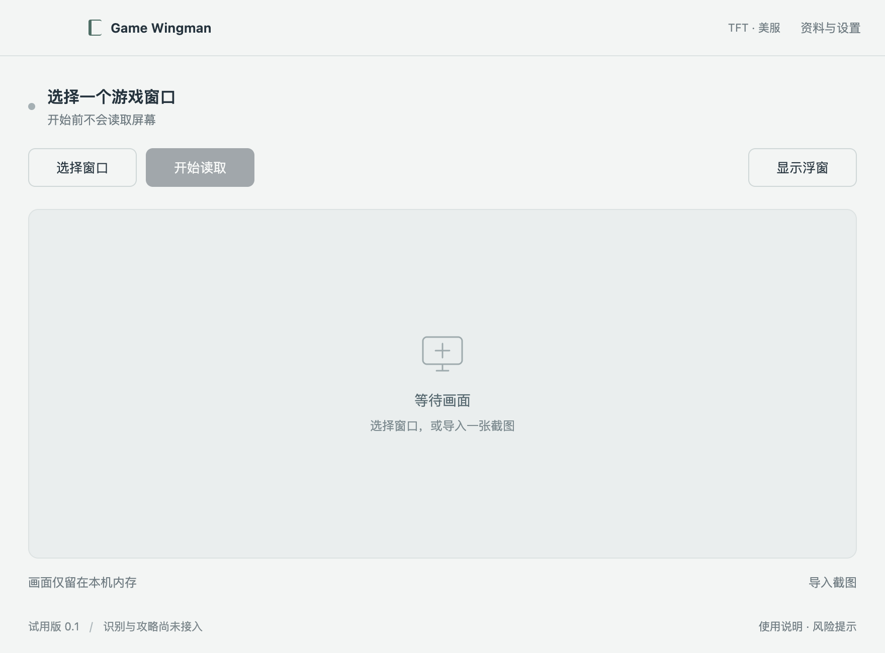

# Game Wingman


**AI 游戏攻略助手实验样品。先以 TFT 为蓝本，再扩展到其他游戏。**

[English](README.md) · [Windows 接续指南](docs/windows-handoff.md) · [API 配置](docs/api-providers.md) · [问题反馈](https://github.com/maxuod/game-wingman/issues/new/choose)

这是 Electron + TypeScript 桌面应用，目标流程是：读取指定游戏窗口 → 识别可见信息 → 检索有来源和版本的攻略 → 在独立浮窗中显示简短解释。首款适配游戏为 TFT，地区以美服 NA、实体名称以 en_US 为准。

公开本项目是为了收集反馈，并为之后的游戏产品积累可复用模块。当前是早期样品，完整 AI 攻略链路尚未完成。

> **试用与封号风险提示**：本项目未获 Riot Games 官方认可。根据当前局势给出实时建议可能违反游戏规则，使用可能导致账号处罚，包括封禁。项目不保证账号安全、识别准确性、攻略有效性或胜率。试用品标签不构成规则豁免，使用前请阅读[试用说明](docs/usage.md)。

## 数据来源与署名

数据来源不限于 OP.GG。[来源登记表](docs/data-sources.md)列明 Riot、OP.GG、CommunityDragon 等来源的用途、版本、署名与使用条件，并区分公开主线、本地接入、研究和候选。新增数据源时同步更新登记表与[第三方说明](THIRD_PARTY_NOTICES.md)。

## 当前可用范围

- 桌面主窗口、独立置顶浮窗、收起、透明度、点击穿透与恢复入口。
- 浮窗默认显示、保持置顶且不抢游戏焦点；自动查找唯一游戏窗口并开始本机预览，支持独立 TFT 客户端。
- 主窗口直接列出当前补丁、近期有效统计中前四率最高的 4 套阵容，点击即可选为目标。自动找到唯一 TFT 游戏窗口后开始读取本机画面；如已保存 DeepSeek 密钥并启用 AI 请求，会弹出本局持续跟进确认，确认后自动识别并随画面更新装备合成和所选阵容的海克斯候选。没有读清的装备不推断可合成；海克斯仅为来源候选，需要核对本局实际选项。
- 选择一个窗口后播放实时本机视频；暂停、继续、关闭源窗口后停止；支持导入截图。
- 美服 Data Dragon 的 Set 18 英雄 / 羁绊名称字典，可手动同步、搜索和固定到浮窗。
- MiniMax 国内、DeepSeek、Gemini 文本 / 图片接口，桌面模型设置、系统加密凭据和手动文字连接测试。
- 每次确认后识别一帧，提取阶段、金币、生命、等级和可见名称；支持未知字段、人工校正和浮窗展示。
- 可单独开启视频持续跟进，每 5–15 秒识别可见字段。本轮固定 DeepSeek，跨暂停/重启累计 ¥10 上限，实时和手动调用共用预算；见[首次测试步骤](docs/deepseek-first-test.md)。
- OP.GG 当前主页面全部 50 套阵容及变体，支持中文搜索、翻页、查看配装和复制阵容码；默认前四率，可切换吃鸡率。启动及手动刷新公开数据，标明日期、补丁和样本量；[数据范围](docs/guide-preview.md)。
- 137 件装备、55 种合成配方。开启装备自动识别后，随新画面自动计算“现在优先合什么、还缺什么”，默认跟随当前推荐阵容；无需手填清单。阵容详情同时展示目标配装、来源站位（当前 39/50 套）和按阵容加载的海克斯候选；[使用与边界](docs/automatic-equipment.md)。
- 每天首次启动核对 TFT 官方补丁和阵容排名；同日复用有效缓存，排名超过 6 小时或官方变化时刷新，标出前四/吃鸡排名升降。装备配方独立保留、等待官方依据核查；[自动更新规则](docs/daily-data-updates.md)。
- 英雄、装备、海克斯使用游戏图标，合成建议显示散件组合、成装和推荐英雄，站位图包含头像与装备。悬停看名称，库存保留数量角标；图片按需加载并缓存，不增加 AI 调用。

**尚未完成：** 真实 TFT 装备识别质量验证、逐回合运营与结合对手/强化符文/当前棋盘强度的战术判断。合成方案是按目标配装补缺的本地规则；统计非独立美服、未隔离 18.3B 热修，不代表本局胜率。当前资料为 Set 18 / 18.3，未确认独立客户端的实际版本。

macOS 和 Windows 已验证桌面外壳及合成窗口读取，Windows 便携包也已通过本机测试。实际 TFT 对局、全屏覆盖与反作弊兼容性尚未验证。详见[验证记录](docs/desktop-validation.md)。

## 简洁的桌面界面

主窗口只有三个主要按钮：选择窗口、开始 / 暂停读取、显示 / 隐藏浮窗。资料和设置收进次级面板，浮窗一次显示一条信息。



截图展示的是当前桌面应用，不是已完成 AI 推荐的演示。`design/` 中的网页只保留作早期设计记录。

## Windows 上继续

安装 Git 和 Node.js 22（22.12–22.x；本机验证版本为 22.23.1），在 PowerShell 执行：

```powershell
git clone https://github.com/maxuod/game-wingman.git "game wingman"
cd "game wingman"
npm ci
npm start
```

启动桌面功能不需要 API Key。具体测试顺序和下一位开发者的上下文已写在 [Windows 接续指南](docs/windows-handoff.md)。

```powershell
npm run check
npm test
npm run test:desktop
npm run package:win
```

Windows 便携包位于 `release/Game Wingman-win32-x64/`，必须保留整个目录。macOS 可用 `npm run package:mac` 生成 arm64 `.app`。产物未做发行签名 / 公证，构建通过不代表游戏实测通过。

## 三家 API

普通使用无需编辑源码：打开“资料与设置 → AI 识别 → API Key 配置”，选择平台、粘贴自己的 Key 并加密保存。也可导入本地 `.env` / JSON，或先保存空白模板填写。[GitHub JSON 空模板](api-keys.example.json)只含空字段，实际密钥不会随源码或软件包分发。[完整操作说明](docs/api-providers.md)。

保存不会启用 AI 或发送测试请求；本轮识别固定 DeepSeek，沿用累计 ¥10 上限。其他两家密钥可以保存。连接测试和画面发送需要另外主动操作。

以下是开发者 CLI 配置：

```powershell
Copy-Item .env.example .env
npm run api:check -- minimax
npm run api:check -- deepseek
npm run api:check -- gemini
```

以上 CLI 命令只在本地检查配置，默认 `AI_ENABLED=false`。桌面可在“资料与设置 → AI 识别”导入本机密钥文件，以系统加密方式保存；手动识别每张确认，持续跟进另需会话确认。仅开启本机预览不调用模型。不要提交密钥到仓库或 Issue。

如需主动测试某家 API，将 `.env` 中 `AI_ENABLED` 设为 `true`，再执行：

```powershell
npm run api:check -- minimax --probe
```

这会发送一次固定文字测试，可能产生费用，不发送截图。没有自动重试或跨提供方回退。三家已完成真实文本 / 合成图片测试；本轮选择 DeepSeek Flash 为默认，Gemini 使用已测通的 3.5 Flash Lite，MiniMax 使用国内 M3。速度结果与使用方法见 [API 提供方说明](docs/api-providers.md)。

## 文档与反馈

[试用说明](docs/usage.md) · [路线图](docs/roadmap.md) · [隐私说明](PRIVACY.md) · [安全反馈](SECURITY.md) · [贡献说明](CONTRIBUTING.md) · [更新记录](CHANGELOG.md)

最新 Windows 包位于 `release/auto-follow-preview/Game Wingman-win32-x64/`，先从托盘退出旧版再运行；同名旧实例会拦截新版启动。保留累计 DeepSeek ¥10 预算。后续验证真实 TFT 装备识别与当前客户端的阵容码导入。

## 许可证

目前是公开源码预览，尚未选定开源复用许可证（`UNLICENSED`），公开可见不等于授予复用许可。第三方依赖和游戏资料分别遵循各自条款，见[第三方说明](THIRD_PARTY_NOTICES.md)。项目没有复制 ARAM-tool 的代码、UI 或商业攻略库。
