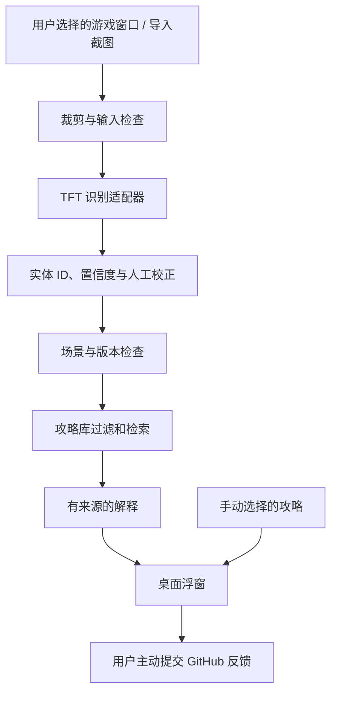

# 技术方案 v0.3

2026-09-24 最新：equipment-preview 已接入 OP.GG 主页面全部 50 套阵容与 137 件装备/55 种配方。`public-data.ts` 只解析公开事实 JSON，校验补丁、范围、条目关系；`equipment.ts` 按所选阵容的核心配装、库存成装及可用散件生成互不重复消耗的优先方案。手动库存优先，AI 库存 15 秒过期。详见[使用与来源](guide-preview.md)。公开刷新和本地计算不调用模型，DeepSeek 累计 ¥10 上限不变。

日期：2026-09-24。目标为公开试用的跨平台技术样品。桌面外壳已实现，运行边界见 [桌面验证记录](desktop-validation.md)。

## 1. 技术选择建议

首个验证版本使用 Electron + TypeScript，共享桌面界面与业务逻辑。渲染层使用原生 HTML/CSS/TypeScript，名称字典使用本地 JSON 缓存。MiniMax / DeepSeek / Gemini 文本和图片接口已接到桌面设置、逐帧发送确认、识别字段校验及人工校正，见 [API 提供方说明](api-providers.md)。已完成真实合成样本比较；真实 TFT 装备识别质量仍待验证；当前已接入版本化阵容事实与本地配装补缺规则。

选择 Electron 的依据是已有桌面捕获和窗口控制接口，便于先验证关键体验，而非已经证明其资源占用或游戏兼容性达标：

- [desktopCapturer](https://www.electronjs.org/docs/latest/api/desktop-capturer)：获取屏幕或窗口来源；macOS 屏幕内容捕获涉及系统授权。
- [BrowserWindow](https://www.electronjs.org/docs/latest/api/browser-window)：提供窗口管理接口，具体浮窗行为仍需实测。
- [Electron 安全文档](https://www.electronjs.org/docs/latest/tutorial/security)：主进程承担系统能力，渲染层通过有限接口调用。

已锁定 Electron 44.4.5、TypeScript 7.0.2 与依赖 lockfile；构建目标为 macOS arm64 和 Windows x64。构建结果与实机验证分开记录，最低系统版本尚未完成兼容性验证。

当前目录：`src/main` 管理窗口、权限、状态、资料下载与缓存；`src/preload` 仅暴露固定 IPC 方法；`src/renderer` 渲染两个应用窗口；`src/shared` 定义接口。主进程校验调用窗口、主 frame 和本地页面 URL，浮窗无权读取来源或导入图片。渲染进程启用 sandbox / contextIsolation，禁用 Node、外部导航和弹窗，页面 CSP 不允许网络请求。

捕获通过系统选定窗口的 video-only 流实时播放，目标 15 fps，不采集音频；本机每秒生成一张候选帧。仅预览时主进程只接收时间戳；手动识别暂停预览并逐张确认。持续跟进另行确认会话，主进程粗略比较缩略图变化，最短 5 秒一次、静态 15 秒复查；只保留一个在途请求。epoch 和会话 revision 阻止旧来源或已取消响应覆盖新状态，允许同一会话的识别结果在预览继续前进时显示其原始画面时间。结果超过 15 秒或输入停止更新即过时/停止。没有默认截图落盘。

当前首次测试固定 DeepSeek Flash，主进程 `ai/budget.ts` 在请求前持久预留最坏费用，返回有效 token 后按高峰无缓存价核算，所有桌面 AI 请求共享跨会话/重启累计 ¥10。失败/未知用量保留预留额，账本损坏或写入失败锁定后续请求。见[测试预算原理](deepseek-first-test.md)。点击“同步资料”才访问固定 Riot Data Dragon HTTPS 地址，NA 资源字典不等同于攻略库。

## 2. 模块与数据流

动态路径随新的有效画面更新检索和解释；静态路径用于直接阅读或识别失败时降级。上述设计是实验样品的技术范围，不代表实时局势建议已获 Riot 批准，使用风险在产品文档与试用说明中明确披露。

建议模块：

| 模块 | 职责 |
| --- | --- |
| desktop | 权限、窗口、快捷键、采集生命周期 |
| capture | 来源选择、裁剪、时间戳、图像去重 |
| games/tft | TFT 区域定义、实体字典、解析与字段校验 |
| knowledge | 攻略导入、审核、版本筛选、检索 |
| explanation | 证据绑定、模型调用、输出校验、降级 |
| overlay | 卡片渲染、交互模式、位置和显示状态 |

捕获和浮窗不依赖 TFT 实体。未来游戏通过各自适配器接入，并单独定义允许的使用场景；不能照搬 TFT 的内容结构和规则。适配器提供游戏 ID、画面区域、实体映射、观察结构与检索条件，公共模块只处理统一接口。

## 3. 屏幕处理策略

1. 用户显式选择窗口或导入图片，预览后开始处理；初始不持续录制整个桌面。
2. 优先裁剪必要区域，原图默认仅留在内存。云端处理需在启用时明确告知发送范围；本轮不上传任何截图。
3. 文字区用 OCR 候选方案，图标区评估模板/视觉识别。可用视觉模型建立对照基线，但不能把模型自报置信度当作已校准概率。
4. 输出结构化观察，不在识别阶段生成战术结论。未知实体和模糊区域保留为 unknown。
5. 验证 entity ID、数值范围、赛季和客户端；冲突字段等待校正。
6. 采集窗口消失、权限撤回或切换来源时停止旧任务；按 observation ID 丢弃迟到结果。

先用单次触发调试，再加入低频采样与画面变化检测。采样频率通过基准测试确定；同一时刻只处理有限任务，合并重复帧并取消过时任务，避免连续请求堆积与费用失控。

## 4. 初始数据模型

| 数据 | 最少字段 |
| --- | --- |
| Entity | game、set、patch、locale、entity_id、name、aliases、asset_ref |
| Guide | id、game、set、patch_scope、locale、title、body、entity_ids、scenario |
| Source | id、url/reference、author、usage_basis、retrieved_at |
| Review | guide_id、review_status、reviewed_at、content_hash |
| Observation | id、input_kind、captured_at、game、patch_or_unknown、fields、confidence、corrections |
| Explanation | observation_id、guide_ids、source_ids、text、limitations、created_at |

持久化保存设置和已审核知识；Observation 默认只在会话内。诊断只记录耗时、错误类别和版本等必要指标，不默认记录截图、玩家名字或聊天内容。

先按游戏、赛季、补丁和审核状态进行硬过滤，再匹配实体和问题；没有有效候选时返回无匹配。适用多个补丁必须是审核结论，不能自动沿用。

## 5. AI 的职责

检索模块负责选择证据，模型负责解释证据。模型输出必须关联已检索的条目；禁止虚构来源 ID、胜率、版本信息和“最佳选择”。没有证据的句子应删除或标为不确定推断。

内容和截图文字都是输入资料，不能改变应用权限或执行命令。应用运行所需的服务端密钥不放进桌面安装包；本地实验凭据与将来的生产凭据方案分别处理。

模型失败时仍能展示原始攻略摘录；AI 调用不是阅读已选攻略的前提。

## 6. 浮窗和跨平台验证

- 优先验证窗口模式和无边框窗口模式。独占全屏、macOS 全屏空间单列结果，不承诺普通置顶窗口一定覆盖所有游戏模式。
- 浮窗默认为阅读状态；通过快捷键切换交互/穿透，显示时不夺取焦点。
- 检查多显示器、Retina/显示缩放、移除外接显示器和窗口位置恢复。
- 避免把浮窗内容再次识别成游戏内容；优先捕获选定游戏窗口，必要时用固定区域排除，并实测结果。
- 测量遮挡、最小化、焦点切换和权限拒绝时的捕获行为，不能将空白或旧帧当作当前有效画面。
- 捕获不涉及游戏进程注入、内存读取、网络拦截或自动操作。

## 7. 实施顺序

| 阶段 | 可验收产出 |
| --- | --- |
| P0：样品定义 | 实时助手目标、试用说明、风险披露、GitHub 反馈模板 |
| P1：桌面技术验证 | 可启动主窗口与浮窗；选定窗口捕获；两平台测试记录 |
| P2：识别与检索 | 游戏窗口/截图输入、少量实体识别、人工校正、带版本攻略检索 |
| P3：动态闭环 | 低频更新、来源绑定的 AI 解释、过时任务处理、延迟与成本记录 |
| P4：GitHub 试用发布 | 可复现运行说明、演示、已知限制、实际支持平台和版本材料 |
| P5：反馈迭代 | 修复高频问题、整理适配器接口、选择第二款游戏验证复用 |

首个开发任务从 P1 开始。发布以可运行样品及明确的测试边界为目标，不等待商业系统完善；双平台是目标，每个发布版本如实标注已验证和未验证的平台。不能以构建成功代替实际游戏中的验证。
